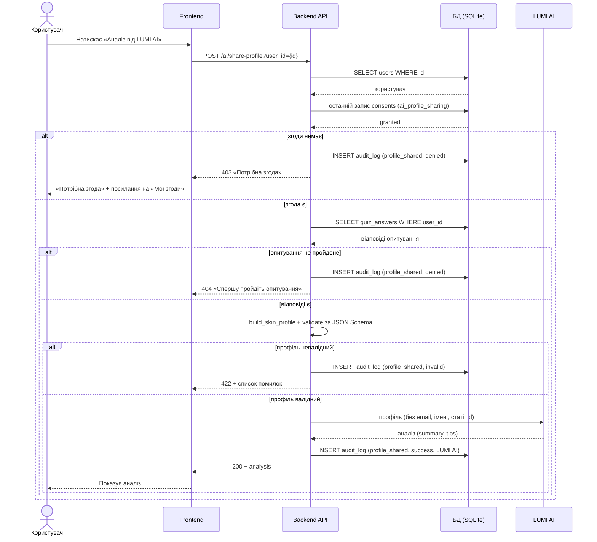

# UC-07. Діаграма послідовності: передача профілю в LUMI AI (задача 4.4)

Реалізація: `POST /ai/share-profile` (backend/lumi_ai.py, #144).

```mermaid
sequenceDiagram
    actor U as Користувач
    participant F as Frontend
    participant B as Backend API
    participant D as БД (SQLite)
    participant AI as LUMI AI

    U->>F: Натискає «Аналіз від LUMI AI»
    F->>B: POST /ai/share-profile?user_id={id}
    B->>D: SELECT users WHERE id
    D-->>B: користувач
    B->>D: останній запис consents (ai_profile_sharing)
    D-->>B: granted

    alt згоди немає
        B->>D: INSERT audit_log (profile_shared, denied)
        B-->>F: 403 «Потрібна згода»
        F-->>U: «Потрібна згода» + посилання на «Мої згоди»
    else згода є
        B->>D: SELECT quiz_answers WHERE user_id
        D-->>B: відповіді опитування
        alt опитування не пройдене
            B->>D: INSERT audit_log (profile_shared, denied)
            B-->>F: 404 «Спершу пройдіть опитування»
        else відповіді є
            B->>B: build_skin_profile + validate за JSON Schema
            alt профіль невалідний
                B->>D: INSERT audit_log (profile_shared, invalid)
                B-->>F: 422 + список помилок
            else профіль валідний
                B->>AI: профіль (без email, імені, статі, id)
                AI-->>B: аналіз (summary, tips)
                B->>D: INSERT audit_log (profile_shared, success, LUMI AI)
                B-->>F: 200 + analysis
                F-->>U: Показує аналіз
            end
        end
    end
```